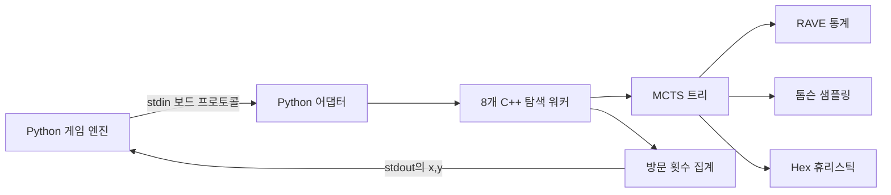

# Hex AI: 탐색, 샘플링, 고성능 게임 플레이

**한국어** | [English](README.md)

제한된 경기 시간 안에서 Hex를 플레이하기 위해 몬테카를로 트리 탐색(MCTS), RAVE(Rapid Action Value Estimation), 톰슨 샘플링을 결합하고 최적화한 AI 엔지니어링 포트폴리오 프로젝트입니다.


## 프로젝트 한눈에 보기

| 영역 | 구현 내용 |
| --- | --- |
| 탐색 연구 | UCB, 톰슨 샘플링, RAVE-UCB, RAVE-TS의 네 가지 Python 변형 비교 |
| 시스템 엔지니어링 | 표준 입출력 프로토콜로 Python 심판과 연결되는 C++17 탐색 엔진 |
| 성능 최적화 | 8개 루트 병렬 워커, union-find 승리 판정, 메모리 풀, 적응형 시간 배분 |
| 게임 전략 | 파이 룰, 브리지 방어 롤아웃, 수 정렬, 즉시 승리·차단 검사 |
| 평가 | 게임 규칙 단위 테스트, 토너먼트 도구, Davis 및 HexHex 상대 기록 경기 |

최종 에이전트는 RAVE 정보를 활용하는 톰슨 샘플링 기반 MCTS입니다. 읽기 쉬운 Python 연구 버전에서 시작해, 시뮬레이션 처리량이 핵심 병목으로 확인된 뒤 C++ 최적화 버전으로 발전시켰습니다.

## 나의 기여

이 저장소는 University of Manchester의 COMP34111 AI & Games 과목 Group 026 프로젝트에서 시작되었습니다. 문서화된 개인 기여의 중심은 다음과 같습니다.

- 네 가지 Python MCTS 변형 구현 및 비교;
- 내부 라운드로빈 결과를 바탕으로 RAVE + 톰슨 샘플링 방향 선정;
- Hex 전용 브리지 방어, 오프닝, 스왑 휴리스틱 추가;
- C++17 이전 및 8개 워커 루트 병렬화 주도;
- 셀프플레이 데이터 생성 및 AlphaZero 방식 탐색.

팀 소유의 프레임워크 코드와 과거 실험은 맥락을 위해 유지합니다. 개인정보가 포함된 평가 문서는 공개 포트폴리오 트리에서 제외했습니다.

## 기술 설계



연구 버전은 선택, 확장, 시뮬레이션, 역전파의 공통 MCTS 흐름을 사용하고 자식 노드 선택 정책만 바꿉니다. 최종 C++ 에이전트는 disjoint-set 보드, 워커별 메모리 풀, 병렬 루트 탐색, 전술 검사, 시간 관리자를 추가합니다.

세부 구성과 코드 위치는 [아키텍처 설명](docs/architecture.ko.md)에서 확인할 수 있습니다.

## 결과와 근거

저장소에는 수동으로 기록한 네 번의 11 x 11 경기가 포함되어 있습니다.

| 에이전트 | 상대 | 순서 | 기록 결과 |
| --- | --- | --- | --- |
| RAVE-TS | Davis 7 | 선공 | 승리 |
| RAVE-TS | Davis 10 | 선공 | 승리 |
| RAVE-TS | HexHex | 후공 | 패배 |
| MCTS 기준 모델 | HexHex | 후공 | 패배 |

이 스크린샷은 개별 실행의 정성적 근거이며, 전체 승률을 의미하지 않습니다. 메타데이터는 [CSV](assets/results/recorded-matches.csv)로 제공합니다. 결과 갤러리와 비교 방식, 평가 한계는 [실험 및 근거](docs/experiments.ko.md)에 정리했습니다.

## 로컬 실행

Python 연구 에이전트는 표준 라이브러리만 사용하며 Python 3.10 이상이 필요합니다.

```bash
cd engine
python Hex.py -b 7 -v \
  -p1 "agents.Group26.Agent_RAVE_TS Agent_RAVE_TS" \
  -p2 "agents.Group26.Agent_UCB Agent_UCB"
```

게임 엔진 테스트:

```bash
cd engine
python -m unittest discover -s test -v
```

최적화 실행 파일은 Linux를 대상으로 합니다. [`deployment/`](deployment/README.ko.md)에서 재현 환경을 빌드할 수 있습니다.

```bash
cd deployment
docker build --build-arg UID="$(id -u)" -t hex-ai .
docker run --cpus=8 --memory=8g -v "$(pwd):/home/hex" --rm -it hex-ai /bin/bash
```

컨테이너 내부:

```bash
chmod +x agents/Group026/RAVE_TS
python3 Hex.py \
  -p1 "agents.Group026.RAVE_TS RAVE_TS" \
  -p2 "agents.Group026.RAVE_TS RAVE_TS"
```

## 저장소 구조

```text
.
├── engine/                  Python 게임 엔진과 연구 에이전트
├── deployment/              재현 가능한 Linux 이미지와 최종 C++ 에이전트
├── assets/
│   └── results/             경기 스크린샷과 구조화된 메타데이터
├── docs/
│   ├── architecture.md      시스템 및 알고리즘 설계
│   ├── experiments.md       비교 방식과 결과 갤러리
│   ├── references.md        외부 연구 자료
│   └── publication-checklist.md
└── NOTICE.md                소유권 및 재사용 안내
```

## 문서

- [문서 인덱스](docs/README.ko.md)
- [아키텍처](docs/architecture.ko.md) / [English](docs/architecture.md)
- [실험 및 근거](docs/experiments.ko.md) / [English](docs/experiments.md)
- [연구 참고문헌](docs/references.md)
- [공개 전 체크리스트](docs/publication-checklist.md)
- [Python 연구 환경](engine/README.ko.md) / [English](engine/README.md)
- [Docker 및 최종 에이전트](deployment/README.ko.md) / [English](deployment/README.md)

## 범위와 출처

제공된 Hex 심판과 팀 소유 프레임워크는 개인 창작물로 제시하지 않습니다. 제3자 논문은 저장소에 재배포하지 않고 링크로 인용합니다. 포트폴리오 설명은 코드, 테스트, 구조화된 경기 메타데이터, 기록 스크린샷이 뒷받침하는 범위로 한정했습니다. 재사용 전 [NOTICE](NOTICE.md)를 확인하세요.
