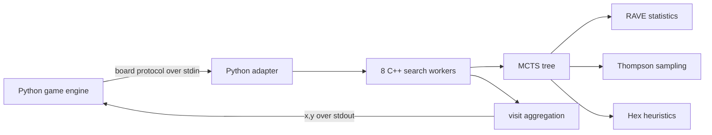

# Hex AI: Search, Sampling, and High-Performance Game Play

[한국어](README.ko.md) | **English**

An AI engineering portfolio project that explores how Monte Carlo Tree Search (MCTS), Rapid Action Value Estimation (RAVE), and Thompson sampling can be combined to play Hex under a strict match-time budget.


## Project at a glance

| Area | What was built |
| --- | --- |
| Search research | Four controlled Python variants: UCB, Thompson sampling, RAVE-UCB, and RAVE-TS |
| Systems engineering | A C++17 search engine connected to the Python referee through a subprocess protocol |
| Performance | Eight root-parallel workers, union-find win detection, pooled allocation, and adaptive time budgets |
| Game strategy | Pie-rule handling, bridge-saving rollouts, move ordering, and immediate win/block checks |
| Evaluation | Unit-tested game rules, tournament tooling, and recorded matches against Davis and HexHex agents |

The final agent is a RAVE-guided Thompson-sampling MCTS implementation. The project moved from a readable Python research baseline to an optimized C++ submission after simulation throughput became the main bottleneck.

## My contribution

This repository originated as a Group 026 project for the University of Manchester's COMP34111 AI & Games course. My documented contribution focused on:

- implemented and compared the four Python MCTS variants;
- used internal round-robin results to select RAVE + Thompson sampling as the development direction;
- added Hex-specific bridge-saving, opening, and swap heuristics;
- led the C++17 migration and eight-worker root parallelization;
- explored self-play data generation and an AlphaZero-style model.

Team-owned framework code and historical experiments remain in the repository for context. Personal assessment documents are intentionally excluded from the public portfolio tree.

## Technical design



The research implementation shares one MCTS lifecycle - selection, expansion, simulation, and backpropagation - while changing only the child-selection policy. The final C++ agent adds a disjoint-set board, per-worker memory pools, parallel root search, tactical checks, and a time manager.

Read the [architecture walkthrough](docs/architecture.md) for component-level details and code pointers.

## Results and evidence

The repository includes four manually recorded 11 x 11 matches:

| Agent | Opponent | Side | Recorded result |
| --- | --- | --- | --- |
| RAVE-TS | Davis 7 | First | Win |
| RAVE-TS | Davis 10 | First | Win |
| RAVE-TS | HexHex | Second | Loss |
| MCTS baseline | HexHex | Second | Loss |

These screenshots are qualitative evidence from individual runs, not an aggregate win-rate claim. Their metadata is available as [CSV](assets/results/recorded-matches.csv). See [experiments and evidence](docs/experiments.md) for the result gallery, comparison design, and evaluation limitations.

## Run locally

The Python research agents use only the standard library. Python 3.10 or later is required.

```bash
cd engine
python Hex.py -b 7 -v \
  -p1 "agents.Group26.Agent_RAVE_TS Agent_RAVE_TS" \
  -p2 "agents.Group26.Agent_UCB Agent_UCB"
```

Run the game-engine tests:

```bash
cd engine
python -m unittest discover -s test -v
```

The optimized executable targets Linux. Build and run its reproducible environment from [`deployment/`](deployment/README.md):

```bash
cd deployment
docker build --build-arg UID="$(id -u)" -t hex-ai .
docker run --cpus=8 --memory=8g -v "$(pwd):/home/hex" --rm -it hex-ai /bin/bash
```

Inside the container:

```bash
chmod +x agents/Group026/RAVE_TS
python3 Hex.py \
  -p1 "agents.Group026.RAVE_TS RAVE_TS" \
  -p2 "agents.Group026.RAVE_TS RAVE_TS"
```

## Repository guide

```text
.
├── engine/                  Python game engine and research agents
├── deployment/              Reproducible Linux image and final C++ agent
├── assets/
│   └── results/             Screenshots and structured match metadata
├── docs/
│   ├── architecture.md      System and algorithm design
│   ├── experiments.md       Comparison method and result gallery
│   ├── references.md        External research sources
│   └── publication-checklist.md
└── NOTICE.md                Ownership and reuse notice
```

## Documentation

- [Documentation index](docs/README.md)
- [Architecture](docs/architecture.md) / [아키텍처](docs/architecture.ko.md)
- [Experiments and evidence](docs/experiments.md) / [실험 및 근거](docs/experiments.ko.md)
- [Research references](docs/references.md)
- [Publication checklist](docs/publication-checklist.md)
- [Python research environment](engine/README.md) / [한국어](engine/README.ko.md)
- [Docker and final agent](deployment/README.md) / [한국어](deployment/README.ko.md)

## Scope and attribution

The supplied Hex referee and team-owned framework are not presented as individual work. Third-party papers are cited by link instead of being redistributed. Portfolio claims are limited to what is supported by the code, tests, structured match metadata, and recorded screenshots. See [NOTICE](NOTICE.md) before reusing project material.
