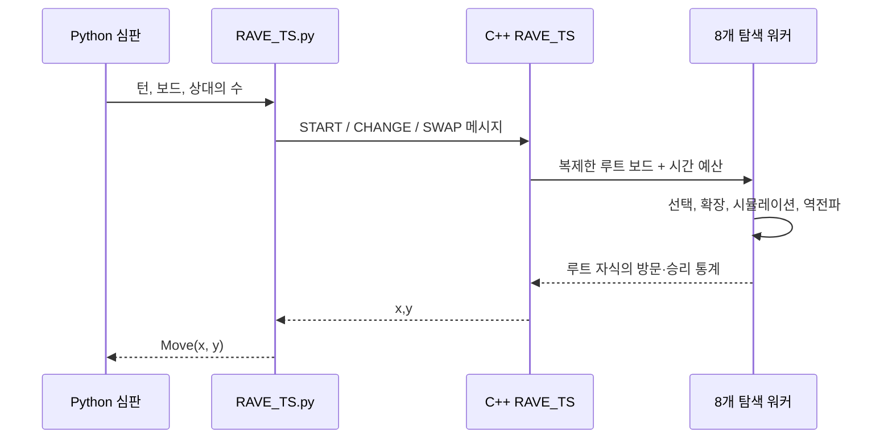

# 아키텍처

**한국어** | [English](architecture.md) | [포트폴리오 홈](../README.ko.md)

## 설계 목표

시스템은 11 x 11 Hex 보드에서 전체 5분의 경기 시간을 여러 턴에 나누어 사용하며 합법적이고 경쟁력 있는 수를 선택해야 합니다. 따라서 저장소는 통제된 비교를 위한 읽기 쉬운 Python 연구 환경과 시뮬레이션 처리량을 높인 C++ 최종 에이전트를 함께 제공합니다.

## 실행 흐름

[`deployment/agents/Group026/RAVE_TS.py`](../deployment/agents/Group026/RAVE_TS.py)의 Python 어댑터가 보드를 직렬화하고 표준 입출력으로 C++ 실행 파일과 통신합니다. 제공된 심판 인터페이스는 유지하면서 계산량이 큰 탐색만 네이티브 코드로 이동한 구조입니다.

## 연구 구현

[`engine/agents/Group26/mcts_core.py`](../engine/agents/Group26/mcts_core.py)는 다음 공통 탐색 흐름을 담당합니다.

1. 현재 보드의 루트 노드 생성;
2. 확장 가능한 노드까지 자식 선택;
3. 합법 수 하나 확장;
4. 무작위 롤아웃 완료;
5. 직접 통계와 RAVE 통계 역전파;
6. 방문 횟수가 가장 많은 루트 자식 선택.

네 개의 작은 하위 클래스가 선택 정책만 분리합니다.

| 에이전트 | 직접 추정 | 탐색 / 샘플링 | RAVE |
| --- | --- | --- | --- |
| `Agent_UCB` | 경험적 승률 | UCB1 | 없음 |
| `Agent_TS` | 베타 사후분포 | 톰슨 샘플링 | 없음 |
| `Agent_RAVE_UCB` | MC와 AMAF 값 혼합 | UCB1 | 있음 |
| `Agent_RAVE_TS` | 직접·AMAF 카운트 혼합 | 톰슨 샘플링 | 있음 |

보드 처리, 롤아웃, 역전파, 시간 배분은 공유하므로 선택 정책의 차이를 쉽게 확인할 수 있습니다.

## 최적화 에이전트

최종 구현은 [`deployment/agents/Group026/RAVE_TS.cpp`](../deployment/agents/Group026/RAVE_TS.cpp)입니다.

### 보드 표현

`FastBoard`는 고정 크기 배열에 셀을 저장하고 disjoint-set 연결 상태를 유지합니다. 수를 둘 때 같은 색의 인접 돌과 가상 가장자리를 union하므로, 매번 그래프를 순회하지 않고 두 대표 루트 비교로 승리를 판정합니다.

### 탐색 정책

각 노드는 방문, 승리, RAVE 방문, RAVE 승리를 기록합니다. 직접 근거와 RAVE 근거를 방문 수에 따라 혼합하고, 이를 베타분포 파라미터로 변환한 뒤 감마 난수로 점수를 샘플링합니다. 워커가 종료되면 루트에서 가장 많이 방문한 수를 선택합니다.

### 병렬 처리와 메모리

8개의 독립적인 루트 워커를 `std::async`로 실행합니다. 각 워커가 자체 트리와 polymorphic memory resource를 소유하므로 탐색 중 공유 트리 잠금이 없습니다. 모든 future가 끝난 뒤 루트 자식 통계를 합칩니다.

### Hex 전용 판단

- 중앙 셀과 유용한 거리 2 응답을 우선하도록 확장 순서를 조정합니다.
- 롤아웃 중 위협받은 브리지 패턴을 먼저 방어합니다.
- 즉시 이길 수를 두거나 한 수 뒤의 패배를 차단합니다.
- 후공일 때 hex distance 규칙으로 파이 룰 사용 여부를 결정합니다.
- 초반에는 고정 시간, 이후에는 남은 시간의 일정 비율을 상한과 함께 사용합니다.

## 게임 및 평가 계층

재사용 가능한 심판은 [`engine/src/`](../engine/src/)에 있습니다. 합법 수, 스왑 규칙, 타임아웃, 승리 판정, 결과 형식을 담당합니다. [`engine/Hex.py`](../engine/Hex.py)는 단일 경기를 실행하고 [`engine/HexTournament.py`](../engine/HexTournament.py)는 설정된 에이전트를 찾아 경기 및 집계 CSV를 생성합니다.

## 엔지니어링 트레이드오프

- 루트 병렬화는 단순하고 동기화 비용이 없지만 한 수를 탐색하는 동안 워커가 깊은 탐색 결과를 공유하지 않습니다.
- union-find는 점진적 승리 판정을 빠르게 하지만 보드를 복사할 때 연결 상태도 함께 복사합니다.
- RAVE는 초반 추정을 빠르게 하지만 직접 방문이 쌓일수록 AMAF 가정의 신뢰도가 낮아지므로 혼합 비중을 감소시킵니다.
- 휴리스틱 롤아웃은 전술 패턴에서 분산을 줄일 수 있지만 도메인 편향을 만들므로 더 큰 토너먼트 검증이 필요합니다.
