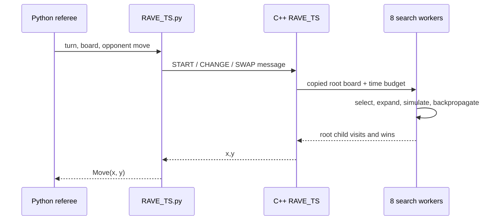

# Architecture

[한국어](architecture.ko.md) | **English** | [Documentation](README.md)

## Design goal

The system must choose legal, competitive moves on an 11 x 11 Hex board while sharing a five-minute match budget across all turns. The repository therefore contains two complementary implementations: a clear Python research environment for controlled comparisons and an optimized C++ agent for simulation throughput.

## Runtime flow

The Python adapter in [`deployment/agents/Group026/RAVE_TS.py`](../deployment/agents/Group026/RAVE_TS.py) serializes the board and communicates with the C++ executable over standard input and output. This keeps the supplied referee interface unchanged while moving the expensive search into native code.

## Research implementation

[`engine/agents/Group26/mcts_core.py`](../engine/agents/Group26/mcts_core.py) owns the common search lifecycle:

1. create a root node for the current board;
2. select children until an expandable node is reached;
3. expand one legal move;
4. complete a randomized rollout;
5. backpropagate direct and RAVE statistics;
6. choose the root child with the highest visit count.

Four small subclasses isolate the selection policy:

| Agent | Direct estimate | Exploration / sampling | RAVE |
| --- | --- | --- | --- |
| `Agent_UCB` | Empirical win rate | UCB1 | No |
| `Agent_TS` | Beta posterior | Thompson sampling | No |
| `Agent_RAVE_UCB` | Blended MC and AMAF value | UCB1 | Yes |
| `Agent_RAVE_TS` | Blended direct and AMAF counts | Thompson sampling | Yes |

This separation makes the comparison easy to inspect: board handling, rollout, backpropagation, and time allocation remain shared.

## Optimized agent

The final implementation is [`deployment/agents/Group026/RAVE_TS.cpp`](../deployment/agents/Group026/RAVE_TS.cpp).

### Board representation

`FastBoard` stores cells in fixed-size arrays and maintains disjoint-set connectivity. A move unions adjacent same-colour stones and the appropriate virtual edges; a win check becomes a comparison of two representative roots instead of a fresh graph traversal.

### Search policy

Each node tracks visits, wins, RAVE visits, and RAVE wins. Selection blends direct and RAVE evidence with a visit-dependent weight, converts the blended evidence into beta-distribution parameters, and samples a score through gamma variates. The most visited root move is selected after the workers finish.

### Parallelism and memory

Eight independent root workers run with `std::async`. Each worker owns its tree and a polymorphic memory resource, avoiding shared-tree locking during the search. Root-child statistics are merged after all futures complete.

### Hex-specific decisions

- ordered expansion favors central cells and useful distance-two replies;
- rollouts attempt to save threatened bridge patterns before choosing randomly;
- an immediate tactical scan plays a winning move or blocks a one-move loss;
- the second player applies a hex-distance rule to decide whether to use the pie rule;
- early turns receive a fixed budget, while later moves use a capped fraction of remaining time.

## Game and evaluation layer

The reusable referee lives under [`engine/src/`](../engine/src/). It validates moves, enforces the swap rule and timeouts, detects wins, and formats results. [`engine/Hex.py`](../engine/Hex.py) runs one match; [`engine/HexTournament.py`](../engine/HexTournament.py) discovers configured agents and exports match and aggregate CSV data.

## Engineering trade-offs

- Root parallelism is simple and avoids synchronization, but workers do not share deeper discoveries during a move.
- Union-find makes incremental win checks cheap, but copying a board also copies connectivity state.
- RAVE accelerates early estimates, but its all-moves-as-first assumption becomes less reliable as direct visit counts grow; the blend therefore decays with visits.
- Heuristic rollouts reduce variance in recognizable tactical positions, but introduce domain bias that should be validated with larger tournaments.
