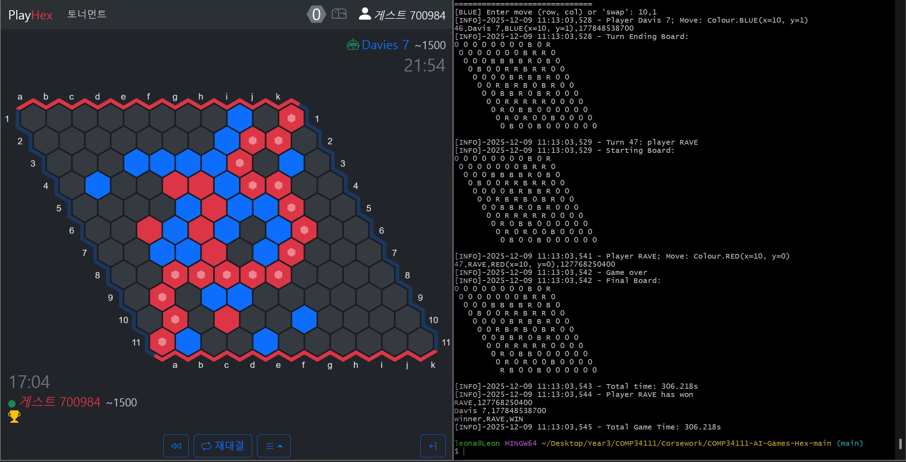
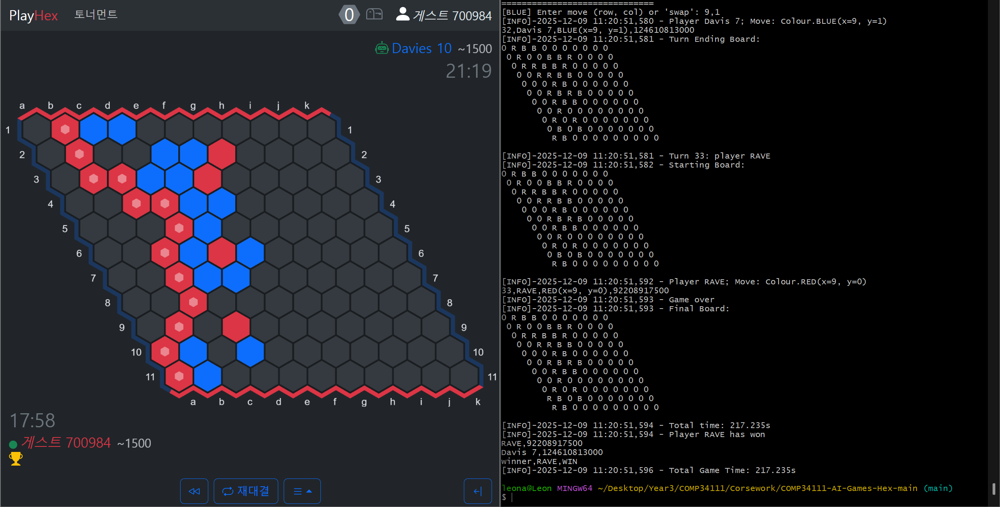
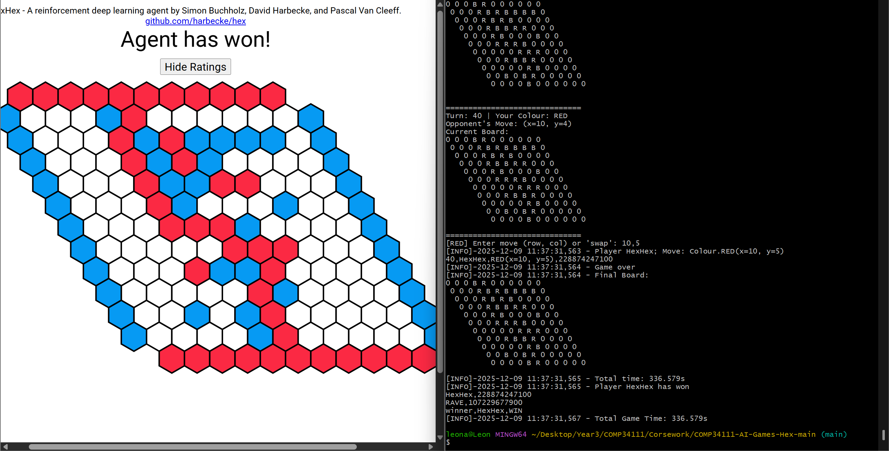
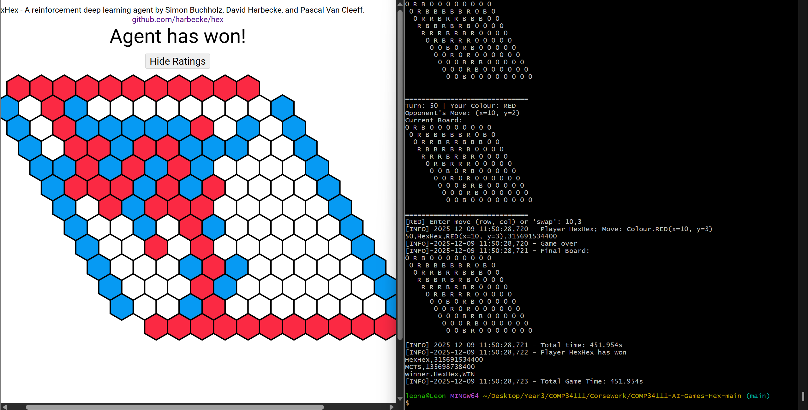

# 실험 및 근거

**한국어** | [English](experiments.md) | [문서](README.ko.md)

## 질문

Python MCTS의 나머지 파이프라인을 동일하게 유지할 때 어떤 트리 선택 정책이 실전 Hex에서 가장 강한가? 또한 Python의 시뮬레이션 속도가 병목이 된 뒤에는 어떤 엔지니어링 변화가 필요한가?

## 통제된 변형

네 에이전트는 모두 [`mcts_core.py`](../engine/agents/Group26/mcts_core.py)의 같은 구현을 상속합니다. 합법 수 생성, 확장, 무작위 롤아웃, 역전파, 300초 경기 예산, 루트 방문 횟수에 따른 최종 선택을 공유합니다.

| 변형 | 선택 규칙 | 의도 |
| --- | --- | --- |
| UCB | 승률 + 탐색 보너스 | 불확실한 수를 낙관적으로 탐색 |
| 톰슨 샘플링 | 베타 사후분포에서 표본 추출 | 승리 가능성에 비례한 탐색 |
| RAVE-UCB | 직접 추정과 AMAF 추정을 혼합한 뒤 UCB 추가 | 빠른 초기 추정과 명시적 탐색 |
| RAVE-TS | 직접·RAVE 카운트를 베타 사후분포에 혼합 | 빠른 정보 공유와 확률적 탐색 |

원본 프로젝트 기록은 셀프플레이와 그룹 내부 토너먼트에서 RAVE-TS가 네 구현 중 가장 강했다고 설명합니다. 그러나 해당 토너먼트 CSV는 저장소에 없으므로, 이를 독립적으로 재현 가능한 집계 수치가 아니라 과거의 결론으로 구분합니다.

## 기록 경기 갤러리

스크린샷의 기계 판독 가능한 메타데이터는 [`recorded-matches.csv`](../assets/results/recorded-matches.csv)에 있습니다.

### RAVE-TS vs Davis 7 - 선공 승리

캡처된 심판 출력은 47턴 뒤 RAVE의 승리를 기록합니다.

### RAVE-TS vs Davis 10 - 선공 승리

캡처된 심판 출력은 33턴 뒤 RAVE의 승리를 기록합니다.

### RAVE-TS vs HexHex - 후공 패배

기록 경기에서는 외부 에이전트가 40턴 뒤 승리했습니다.

### MCTS 기준 모델 vs HexHex - 후공 패배

기준 모델의 패배는 50턴 뒤 기록되었습니다. 동일 시드의 반복 실험이 아닌 별도 경기이므로 턴 수만으로 RAVE의 개선 폭을 입증할 수는 없습니다.

## 최종 에이전트에서 달라진 점

최적화 버전은 RAVE 기반 톰슨 샘플링을 유지하면서 다음을 추가합니다.

- C++17 핵심 경로;
- union-find 연결 판정;
- 8개의 독립 루트 병렬 탐색;
- 워커별 메모리 풀;
- 브리지 방어 시뮬레이션 수;
- 휴리스틱 수 정렬;
- 즉시 승리 및 차단 탐지;
- hex distance 기반 오프닝 스왑 규칙;
- 턴과 남은 시간을 고려한 시간 배분.

이 변화들은 처리량과 탐색 품질을 동시에 개선하므로 현재 자료만으로 각 기능의 개별 효과를 분리할 수 없습니다.

## 평가 한계

- 네 스크린샷은 개별 결과이며 통계적으로 유의한 승률이 아닙니다.
- 모든 이미지에 상대 버전, 하드웨어, 난수 시드, 전체 명령이 함께 기록되지 않았습니다.
- 초당 시뮬레이션 또는 제거 실험의 벤치마크 표가 저장소에 없습니다.
- 오프닝과 파이 룰을 통제하지 않으면 선공·후공 결과를 직접 비교하기 어렵습니다.
- 과거 기록은 더 큰 셀프플레이와 내부 토너먼트를 설명하지만 원본 데이터셋은 포함되어 있지 않습니다.

## 권장 후속 평가

포트폴리오 수준의 후속 실험에서는 매 대진마다 색을 번갈아 최소 100회의 짝지은 경기를 실행하고 고정 시드 목록을 사용해야 합니다. 에이전트 커밋, 하드웨어, 실행 시간, 시뮬레이션 수, 수의 개수, 색, 스왑 결정, 결과를 CSV로 기록합니다. 각 기준 모델과 RAVE-TS를 비교해 Wilson 신뢰구간과 초당 시뮬레이션을 함께 공개하고, 병렬화·브리지 방어·수 정렬·스왑 휴리스틱을 하나씩 제거하는 실험을 권장합니다.
